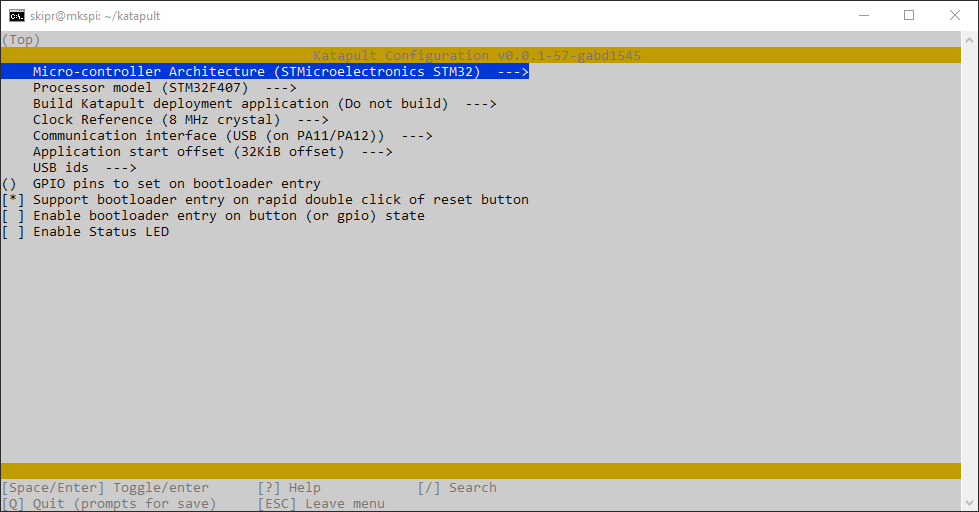
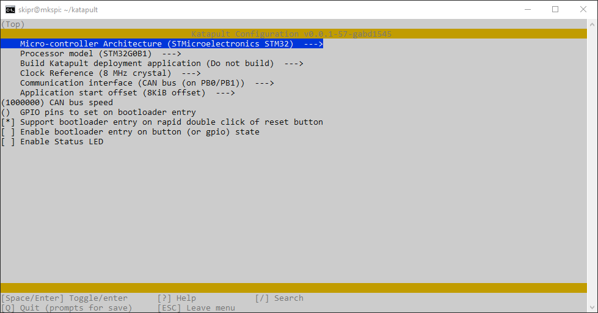
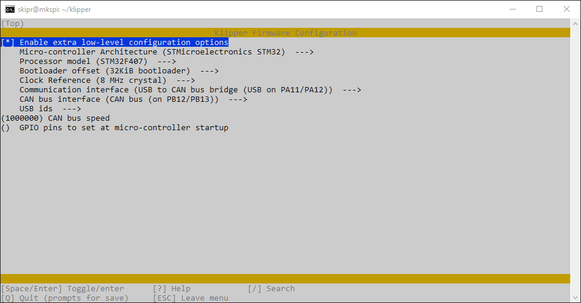
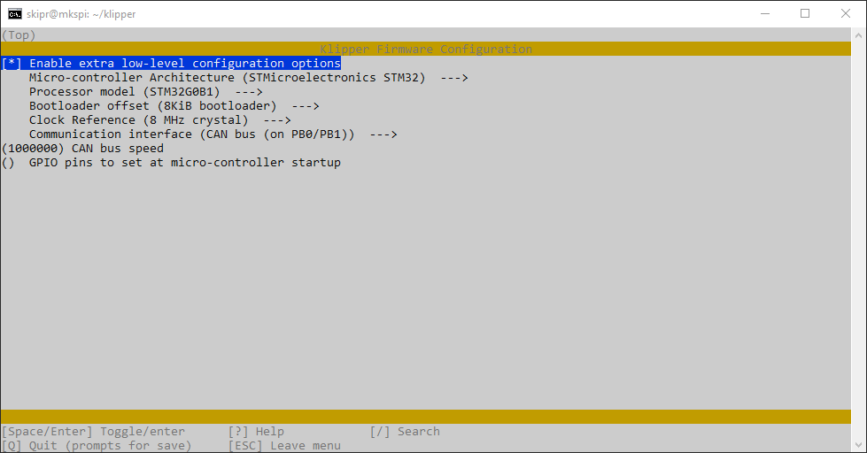
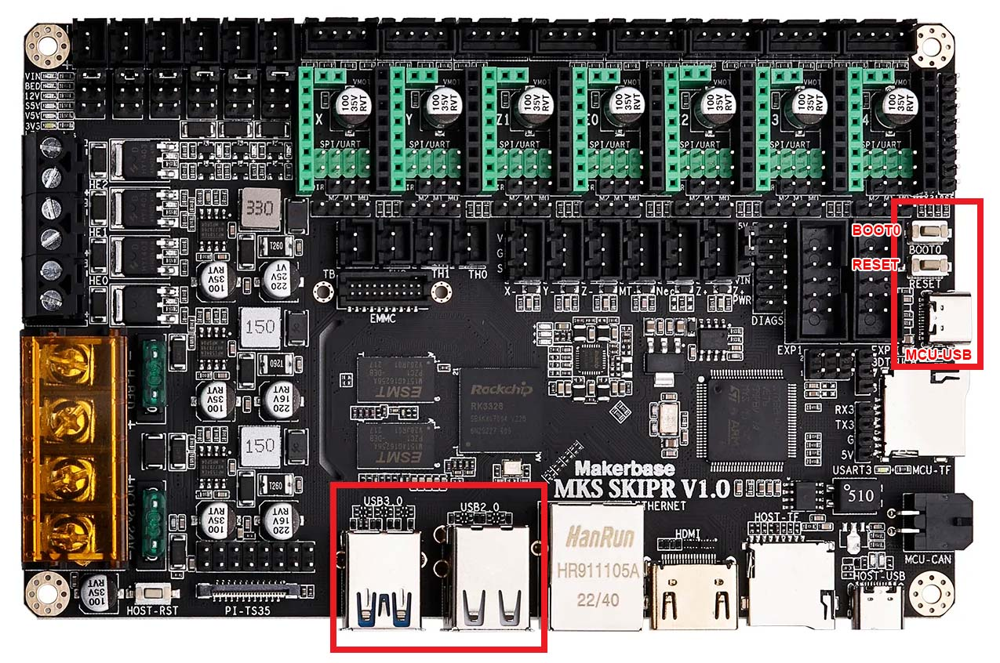
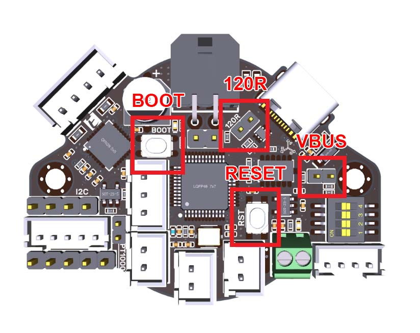

# CAN bridge with MKS SKIPR and BTT EBB36 V1.2

## 1 - Compiling Katapult (Canboot) bootloaders
Clone the Github repository:
```
cd ~
git clone https://github.com/Arksine/katapult
```

Install Python 3 along its serial port extension:
```
sudo apt install python3 python3-pip python3-can
pip3 install pyserial
```

Create a dir for the compiled binaries:
```
mkdir ~/binaries
```

### 1.1 - for MKS SKIPR
```
cd ~/katapult
make clean
make menuconfig
```


Press `Q` to exit and `Y` so save the configuration.

Compile and move the file to a different dir:
```
make
mv ~/katapult/out/katapult.bin ~/binaries/katapult_skipr.bin
```

### 1.2 - for BTT EBB36
```
cd ~/katapult
make clean
make menuconfig
```



Press `Q` to exit and `Y` so save the configuration.

Compile and move the file to a different dir:
```
make
mv ~/katapult/out/katapult.bin ~/binaries/katapult_ebb36.bin
```

## 2 - Compiling Klipper firmwares
If you don't have all the enviroment already setup by [KIAUH](https://github.com/dw-0/kiauh), you must clone Klipper repository:

```
cd ~
git clone https://github.com/Klipper3d/klipper
```

### 2.1 - for MKS SKIPR
```
cd ~/klipper
make clean
make menuconfig
```


Press `Q` to exit and `Y` so save the configuration.

Compile and move the file to a different dir:
```
make
mv ~/klipper/out/klipper.bin ~/binaries/klipper_skipr.bin
```

### 2.2 - for BTT EBB36
```
cd ~/klipper
make clean
make menuconfig
```


Press `Q` to exit and `Y` so save the configuration.

Compile and move the file to a different dir:
```
make
mv ~/klipper/out/klipper.bin ~/binaries/klipper_ebb36.bin
```

## 3 - Flashing CanBoot bootloader and Klipper firmware on MKS SKIPR



Bridge the "Pi" part of the board with the Rockchip RK3328 SoC to the printer controller part with the STMicroelectronics STM32F407 MCU using a USB-A to USB-C cable (usually provided with the board). Connect the USB-A side to any of the USB 2.0 or 3.0 ports, and the USB-C side to **USB-MCU** port close to the **BOOT0** and **RESET** buttons.

Put MKS SKIPR STM32F407 MCU in DFU mode, press and hold both **RESET** and **BOOT0**, release **RESET** and next release **BOOT0**.

Check if it's properly connected by issuing ```lsusb``` command, the output must list the MCU in DFU mode:
```
Bus 001 Device 003: ID 0483:df11 STMicroelectronics STM Device in DFU Mode
```

Flash **CanBoot bootloader**:
```
sudo dfu-util -a 0 -D ~/binaries/katapult_skipr.bin --dfuse-address 0x08000000:force:mass-erase -d 0483:df11
```

While still in DFU mode, flash **Klipper firmware**:
```
sudo dfu-util -a 0 -D ~/binaries/klipper_skipr.bin --dfuse-address 0x08008000:force:leave -d 0483:df11
```

Disconnect the USB-C side of the cable, you'll need it in the next step.

## 4 - Flashing CanBoot bootloader and Klipper firmware on BTT EBB36
> __Warning__
>
> Make sure your wiring is correct, if ou mismatch the pinout, you'll kill your board sending 24V to the MCU as they are different on each end, they are not reversible. Always double check the pinout and label the cable ends.



You have two options to power the BTT EBB36 board:

1. Make sure the **VBUS** jumper is removed and power from CAN BUS cable VCC and GND, or
2. make sure CAN BUS cable is disconnected, install a jumper to the **VBUS** next to the USB-C connector to allow powering the board from USB and connect the USB-C cable.

With the USB-C cable connected, put BTT EBB36 STM32G0B1 MCU in DFU mode, press and hold both **RESET** and **BOOT0**, release **RESET** and next release **BOOT0**.

Check if it's properly connected by issuing ```lsusb``` command, the output must list the MCU in DFU mode:
```
Bus 001 Device 006: ID 0483:df11 STMicroelectronics STM Device in DFU Mode
```

Flash **CanBoot bootloader**:
```
sudo dfu-util -a 0 -D ~/binaries/katapult_ebb36.bin --dfuse-address 0x08000000:force:mass-erase -d 0483:df11
```

While still in DFU mode, flash **Klipper firmware**:
```
sudo dfu-util -a 0 -D ~/binaries/klipper_ebb36.bin --dfuse-address 0x08002000:force:leave -d 0483:df11
```

Disconnect the USB-C from the BTT EBB36 and return it back to the **USB-MCU** port. If the board was powered by USB, move the **VBUS** jumper to the **R120** termination resistor and connect the CAN BUS cable.

## 5 - Setup a CAN0 interface

```
sudo nano /etc/network/interfaces.d/can0
```

Copy and paste this configuration:
```
allow-hotplug can0
iface can0 can static
    bitrate 1000000
    up ip link set $IFACE txqueuelen 128
```

Press `CTRL+X` to exit, `Y` to confirm and `ENTER` to save. Reboot your system with `sudo reboot now`.

After reboot, check if CAN0 state is up and running:
```
ip -details -statistics link show can0
```

## 6 - Get your MCUs UUIDs
Make sure your MCUs UUIDs are not listed in any printer configuration file, or you won't be able to retrieve any node UUID.
```
~/klippy-env/bin/python ~/klipper/scripts/canbus_query.py can0
```

The output must list all nodes (SKIPR STM32F407 and EBB36 STM32G0B1 MCUs):
```
Found canbus_uuid=06727e55c686, Application: Klipper
Found canbus_uuid=4c61f6fc8b08, Application: Klipper
Total 2 uuids found
```

## 7 - Add the MCUs to you printer.cfg
```
[mcu]
canbus_uuid: 06727e55c686

[temperature_sensor skipr] 
sensor_type: temperature_mcu
min_temp: -40
max_temp: 85

[mcu EBBCan]
canbus_uuid: 4c61f6fc8b08

[temperature_sensor EBBCan] 
sensor_type: temperature_mcu
sensor_mcu: EBBCan
min_temp: -40
max_temp: 85
```
## 8 - Updating firmware thru CAN interface
To be able to query all the CAN UUIDs, you have to put the printer in emergency mode by issuing a `M112` command, clicking in `FIRMWARE RESTART` and stopping Klipper service within the menus. Doing it manually is bothersome and prone to errors, but you can do it all at once in the terminal pasting all the commands below:
```
echo M112 > ~/printer_data/comms/klippy.serial 
sleep 1
echo FIRMWARE_RESTART > ~/printer_data/comms/klippy.serial
sleep 1
systemctl stop klipper
```

Query your CAN UUIDs with `cd ~/CanBoot/scripts && python3 flash_can.py -i can0 -q`:
```
Resetting all bootloader node IDs...
Checking for Katapult nodes...
Detected UUID: 06727e55c686, Application: Klipper
Detected UUID: 4c61f6fc8b08, Application: Klipper
Query Complete
```

Now you can flash your device firmware replacing the UUID and PATH:
```
python3 flash_can.py -i can0 -u UUID -f PATH
``` 
